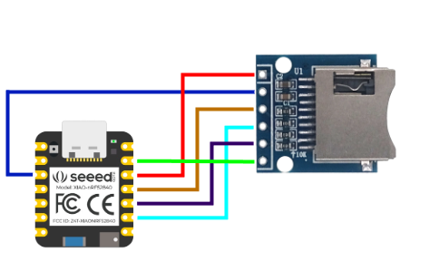
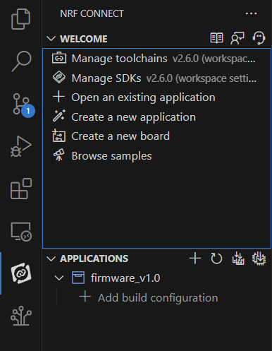
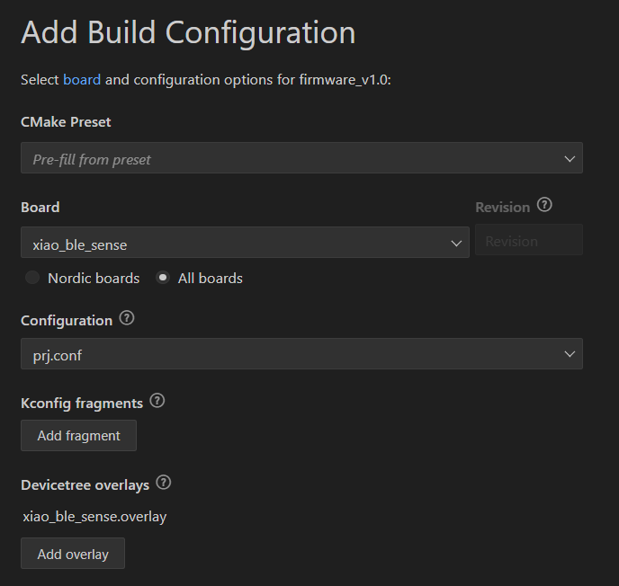
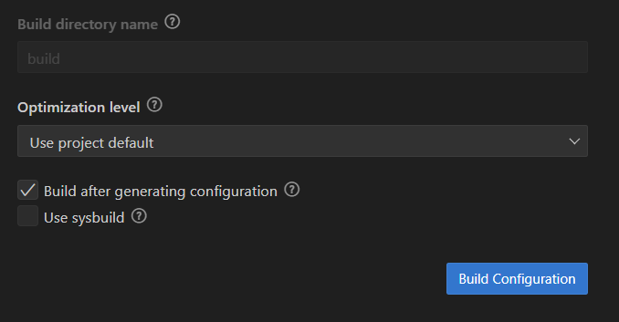
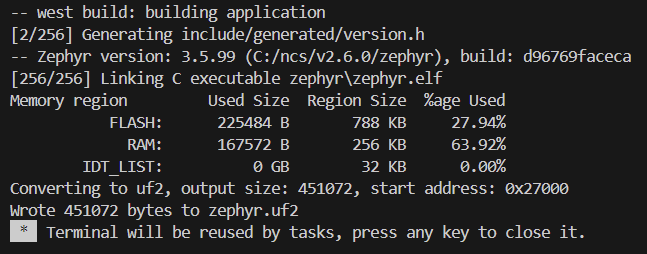

# Redundant local storage

    

 

This solution integrates a microSD memory to provide redundant storage on the device. The redundant storage ensures that the audio files are temporarily saved on the microSD until it is confirmed that they have been correctly transferred to the mobile application. Once the transfer is validated, the data stored on the microSD is deleted, thus ensuring efficient and secure information management. This feature uses a microSD module that operates via SPI, functioning as a bridge between the “XIAO-nRF52840 Sense” board and the micro-SD memory. A notification service is also added to the mobile application to alert if the delayed data has arrived correctly.
</>

## MicroSD Card Module Pin Configuration - SPI

    

The micro-SD card module communicates via the SPI communication protocol. You can connect it to the XIAO-nRF52840 Sense using the default SPI pins. You can buy this module in [Amazon](https://www.amazon.com/RedTagCanada-Storage-Expansion-Soldered-Arduino/dp/B09LTMLJ12/ref=sr_1_61?crid=186EM4TGBRTT&dib=eyJ2IjoiMSJ9.ysWkCOQcBTdneiBpSvvAKKrtj7srmVoT71imrzeFa0enSmZvw0bG4MnVgIHU80dJ1zWteuQVzG4TlX2TxajJ8cVh79vZ1S1Eu3v5B0XQIuI-qvzZg566tzu60kRMY-mrgCmq7vkAS5yNwVG-lAFufuAdS2GNjGKbPUImbbQkh58zZ5YdNiGHNQXyScVS9l3o.81e3AigkNOWHioavXqN1PWDc-NdvahtwwMaEmpgkarc&dib_tag=se&keywords=micro%2Bsd%2Bcard%2Bbreakout&qid=1719634567&sprefix=micro%2Bsd%2Bcard%2Bbre%2Caps%2C210&sr=8-61&th=1)

|  Pin  | SD Card Module | XIAO-nRF52840 |
|-------|----------------|---------------|
|   1   |      3V3       |     VDD       |
|   2   |      CS        |     P0.28     |
|   3   |      MOSI      |     P1.15     |
|   4   |      CLK       |     P1.13     |
|   5   |      MISO      |     P1.14     |
|   6   |      GND       |     GND       |
 
## Preparing the microSD Card

To ensure that the microSD card is in FAT32 format. You can use the software [SD Card Formatter](https://www.sdcard.org/downloads/formatter/) (compatible with Windows and Mac OS).

 

## New code files

The sdcard.c file contains the essential functions for initializing and managing the SD card, including mounting and unmounting the filesystem, and handling file read/write operations. This file ensures that the SD card is properly set up for data storage and retrieval.

The storage.c file focuses on organizing and saving audio data to the SD card. It includes functions for creating new files, managing file paths, and ensuring that data is written correctly. This file also incorporates logic for managing file names and handling the storage of audio data in chunks to optimize performance.

 

# `sdcard.c`

This file contains functions for handling SD card operations, including mounting, reading, and writing to the SD card.

## Functions

### `int mount_sd_card(void)`

Mounts the SD card. Checks if the card is present and initializes it.

**Return:**
- `0` if the SD card was successfully mounted.
- `-1` if there was an error during mounting.

### `int create_file(const char *file_path)`

Creates a new file on the SD card.

**Parameter:**
- `file_path`: Path to the file to be created.

**Return:**
- `0` if the file was created successfully.
- `-1` if there was an error creating the file.

### `int write_file(const uint8_t *data, size_t length)`

Writes data to a file on the SD card.

**Parameters:**
- `data`: Pointer to the data to be written.
- `length`: Length of the data to be written.

**Return:**
- `0` if data was written successfully.
- `-1` if there was an error writing the data.

### `ReadParams read_file(const char *file_path)`

Reads data from a file on the SD card.

**Parameter:**
- `file_path`: Path to the file to be read.

**Return:**
- `ReadParams` containing the data read from the file and a status code (`0` if successful, `-1` if there was an error).

### `int remove_file(const char *file_path)`

Removes a file from the SD card.

**Parameter:**
- `file_path`: Path to the file to be removed.

**Return:**
- `0` if the file was removed successfully.
- `-1` if there was an error removing the file.

---

# `storage.c`

This file contains functions for managing storage on the SD card, including file management and data processing.

## Global Variables

- **`written_max_count`**: Maximum number of frames per file (value: 1000).
- **`file_path`**: Path of the current file.
- **`written_concat`**: Flag indicating if concatenation to an existing file is required.
- **`written_count`**: Number of frames written.
- **`verbose`**: Flag to enable detailed debugging output (value: `true`).
- **`current_path`**: Path of the current file.
- **`file_count`**: File count.

## Functions

### `int init_storage(void)`

Initializes the storage by mounting the SD card. Prints success or error messages based on the operation result.

**Return:**
- `0` if initialization was successful.
- `-1` if there was an error mounting the SD card.

### `ReadInfo get_current_file(void)`

Gets the information of the current file by reading `info.txt`.

**Return:**
- `ReadInfo` with the file name and a status code (`0` if successful, `-1` if there was an error).

### `ReadParams verify_info(void)`

Verifies the information in `info.txt`. If no information is available, creates a file `audio/0.txt` and updates the information.

**Return:**
- `ReadParams` with the file path and a status code (`0` if successful, `-1` if there was an error).

### `int if_file_exist(void)`

Checks if the file exists and, if not, generates a new file name and creates the corresponding file.

**Return:**
- `0` if the file was created or found successfully.
- `-1` if there was an error.

### `int save_audio_in_storage(uint8_t *buffer, size_t length)`

Saves audio data to storage. If the maximum number of frames is reached, resets the counter and concatenation status.

**Return:**
- `0` if storage was successful.
- `-1` if there was an error checking the file.
- `-2` if the SD card is not mounted.

### `char *generate_next_filename(const char *input_filename)`

Generates the name of the next file based on the current file name by incrementing the number in the file name.

**Parameter:**
- `input_filename`: Current file name.

**Return:**
- Name of the next generated file.

### `void process_file(const char *file, char *path, int *status)`

Processes the given file to extract the path and file status.

**Parameters:**
- `file`: File name to process.
- `path`: Path of the processed file.
- `status`: Status of the processed file.

### `char *extract_after(const char *data)`

Extracts a substring from `data` after the prefix `"audio/"`.

**Parameter:**
- `data`: Input string.

**Return:**
- Extracted substring.

### `int extract_number(const char *input, uint8_t *number)`

Extracts a number from the file name in the `input` string.

**Parameters:**
- `input`: String containing the number.
- `number`: Pointer to `uint8_t` where the extracted number will be stored.

**Return:**
- `0` if the number was extracted successfully.
- `-1` if there was an error.

 

## How to compile

Add a new build configuration:

    

 

Choose the board **xiao_ble_sense**, add the configuration file **prj.conf** and finally add the file **xiao_ble_sense.overlay***.

    

 

Finally press **Build configuration**.

    

 

Congratulations you have successfully compiled your project.

    

