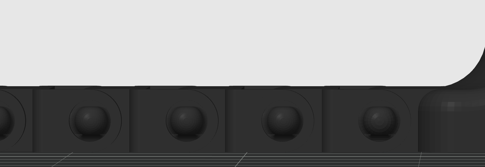
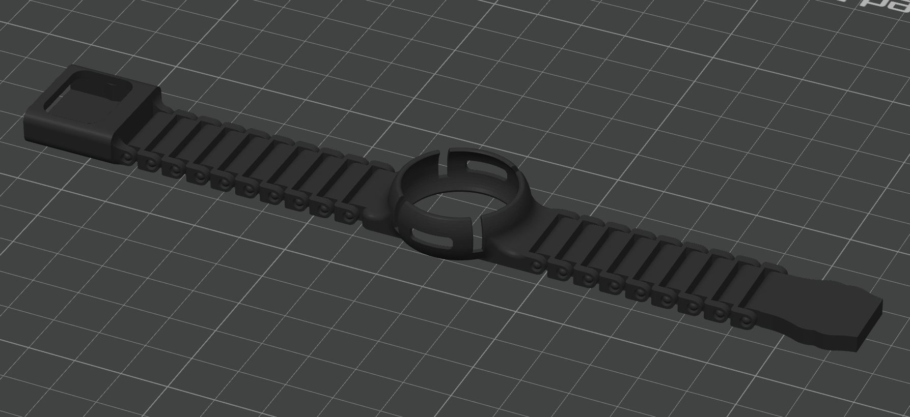

# MUST READ BEFORE PRINTING

This is a watch band for the Omi AI Wearable that requires **NO assembly** and **NO supports**, only a little preparation in the _slicer_.
First, figure out how many chain links (Link.stl) you need. To do this, follow this formula:

(circumference of wrist where you want the watch in centimeters - 5.8cm) / 0.544 rounded up (ex: 16.97 to 17) then add one 1

Either you can modify the .3mf file provided or follow the next steps to set it up yourself.

Next, in the slicer, add the main housing (Omi Watch Band Main (With Band).stl) in the center, then add the chain links, half on each side, and add the male clasp (Clasp Male.stl) and female clasp (Clasp Female.stl) on either side.

Make sure the holes are properly aligned and the layer height should be .08 (whatever the smallest layer height you can get is).

This is what it should look like in the slicer:

After having printed the model, buckle and unbuckle the clasp at least 10 times to loosen it up a little so that it is easier to put on and remove.

Finally, enjoy!
