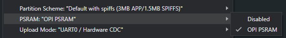

# omiGlass - Open Source Meta Raybans with 6x of their battery

<p align="center">

   
</p>


<p align="center">
  <a href="https://youtube.com/shorts/QvFjXgLZX7U">
    
  </a>
  <br>
  <a href="https://youtube.com/shorts/QvFjXgLZX7U">▶️ Watch Video</a>
</p>


## Want a Pre-built Version?

We will ship a limited number of pre-built kits. Get a Dev [kit here](https://omi.me/glass)

## Community

Join the [Based Hardware Discord](https://discord.gg/omi) for setup questions, contribution guide, and more.

## Getting Started

Follow these steps to set up omiglass:

### Buying guide
   - [Seeed Studio XIAO ESP32 S3 Sense](https://www.amazon.com/dp/B0C69FFVHH/ref=dp_iou_view_item?ie=UTF8&psc=1)
   - x6 150mah batteries like [this](https://a.co/d/i17DjOr) or at least like [this](https://a.co/d/bbFdkic) (but you'll need to increase the size of the casing)
   - 1x 250mah battery like [this](https://a.co/d/2xheiFC)
   - switch like [this](https://a.co/d/gJbWdKn) + [wires](https://a.co/d/ah98wY0) + hinges


### Software

1. Clone the omiglass repository and install the dependencies:

   ```
   git clone https://github.com/BasedHardware/omi.git
   cd omiglass
   npm install
   ```

   You can also use **yarn** to install, by doing

   ```
   yarn install
   ```

2. Add API keys for Groq and OpenAI in the `keys.ts` file located at [https://github.com/BasedHardware/omiglass/blob/main/sources/keys.ts](https://github.com/BasedHardware/omiglass/blob/main/sources/keys.ts).

3. For Ollama, self-host the REST API from the repository at [https://github.com/ollama/ollama](https://github.com/ollama/ollama) and add the URL to the `keys.ts` file. The URL should be http://localhost:11434/api/chat
4. go to terminal and type "ollama pull moondream:1.8b-v2-fp16"

5. Start the application:

   ```
   npm start
   ```

   If using **yarn** start the application with

   ```
   yarn start
   ```

   Note: This is an Expo project. For now, open the localhost link (this will appear after completing step 5) to access the web version.

How you can contribute in software: 
- [ ] Connect glasses with omi app. Currently the glasses only work with web interface

### Hardware


1. 3D print the glasses mount case using the provided STL file located in hardware folder.
2.  Put components like this
   
<p align="center">
  
  
</p>

How you can contribute in hardware: 
- [ ] Redesign the legs/sides so that it would fit on bigger heads
- [ ] add a switch into design (current design is without switch)

### Firmware
1. Open the [firmware folder](https://github.com/BasedHardware/omiglass/tree/main/firmware) and open the `.ino` file in the Arduino IDE.

   - If you don't have the Arduino IDE installed, download and install it from the [official website](https://www.arduino.cc/en/software).
   - Alternatively, follow the steps in the [firmware readme](firmware/readme.md) to build using `arduino-cli`

2. Follow the software preparation steps to set up the Arduino IDE for the XIAO ESP32S3 board:

   - Add ESP32 board package to your Arduino IDE:
     - Navigate to File > Preferences, and fill "Additional Boards Manager URLs" with the URL: `https://raw.githubusercontent.com/espressif/arduino-esp32/gh-pages/package_esp32_index.json`
     - Navigate to Tools > Board > Boards Manager..., type the keyword `esp32` in the search box, select the latest version of `esp32`, and install it.
   - Select your board and port:
     - On top of the Arduino IDE, select the port (likely to be COM3 or higher).
     - Search for `xiao` in the development board on the left and select `XIAO_ESP32S3`.

3. Before you flash go to the "Tools" drop down in the Arduino IDE and make sure you set "PSRAM:" to be "PSRAM: "OPI PSRAM"



4. Upload the firmware to the XIAO ESP32S3 board.


## License

This project is licensed under the MIT License.
