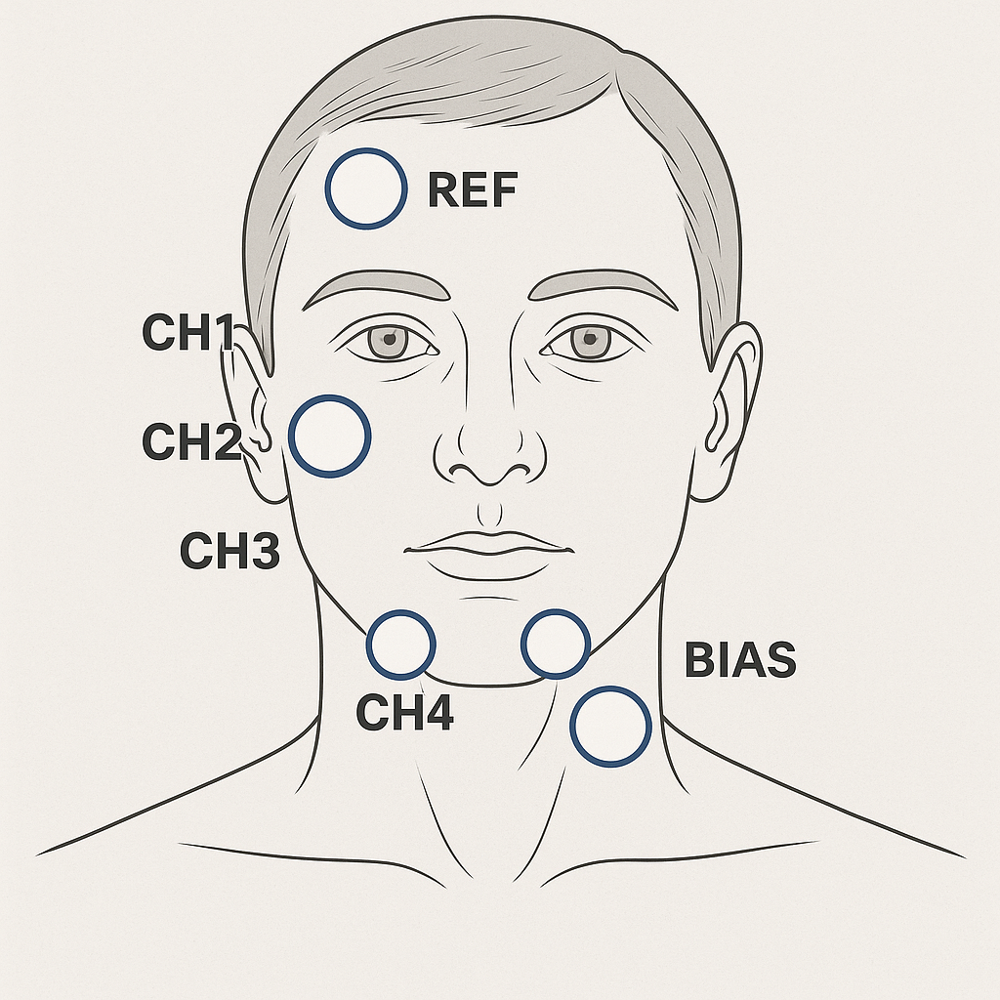

# Omi AI's EMG Electromyography (Silent Talk) Project

Diagram of where to attach the electrodes:



### Masseter (jaw):

Electrode near cheekbone → CH1 upper (+).

Electrode nearer the jaw angle → CH1 lower (–).

### Reference (REF):

Connect REF electrode to REF pin (separate on Ganglion header).

Place on neutral bony spot (forehead).

### Bias (GND):

Connect bias electrode to BIAS pin.

---
```
ChatGPT Generated
Here’s how to place them more precisely:

🔹 Masseter (for CH1 & CH2)

Location: side of the face, between the cheekbone and the angle of the jaw.

How to find: put your fingers on the side of your jaw and clench your teeth — you’ll feel the masseter bulge.

Placement:

CH1: just above the bulge (closer to cheekbone).

CH2: 2–3 cm below, along the same vertical line toward the jaw angle.

Tip: keep both on the thickest part of the muscle, aligned top-to-bottom.

🔹 Chin/Lips (for CH3 & CH4)

You want to capture articulation when you mouth words:

Best target: mentalis muscle (center of chin, under lower lip). It activates when you press/purse lips.

Placement:

CH3: just below the lower lip, center of chin.

CH4: 2–3 cm further down along the midline of the chin.

Alternative: if you prefer lip edge signals, move slightly lateral under the corners of the mouth — but chin midline is cleaner.

🔹 Recap

CH1/CH2: vertically stacked on the masseter, side of jaw.

CH3/CH4: vertically stacked on the chin (mentalis), below the lower lip.

REF: forehead (bony).

BIAS: mastoid (behind ear) or shoulder.
```