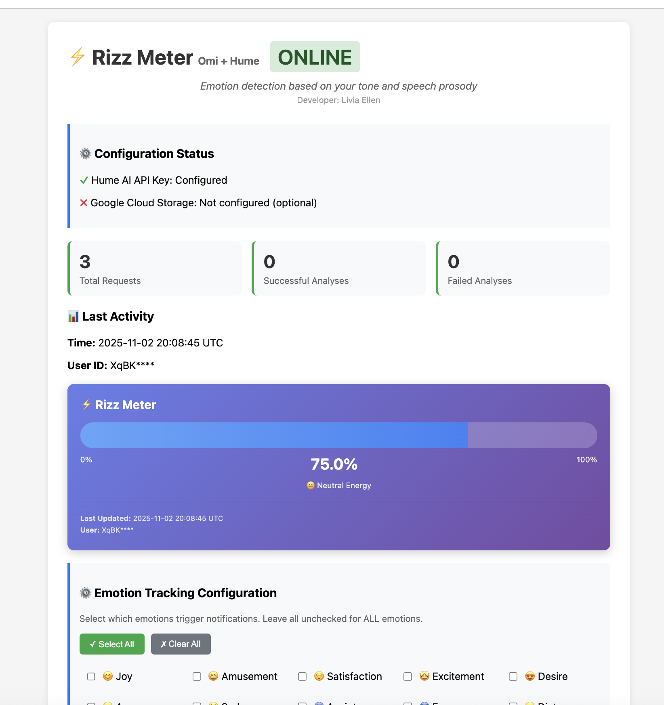

# 🎭 Omi Audio Emotion Analysis with Real-time Notifications

A Python FastAPI service that receives real-time audio from Omi devices, analyzes emotions using Hume AI, sends automatic notifications, and provides a beautiful dashboard with emotion statistics.

## 📸 Screenshots

### Dashboard


### Omi Mobile App Notification


### App Setup Video
[📹 Watch Setup Tutorial](./video/rizz-omi-setup.mov)

## ✨ Features

- 🎤 **Real-time Audio Streaming** from Omi devices
- 🧠 **Emotion Analysis** using [Hume AI's Speech Prosody Model](https://www.hume.ai/products/speech-prosody-model) & Language models
- 📱 **Automatic Notifications** via Omi app when emotions are detected
- 📊 **Live Dashboard** with emotion statistics and percentages
- ⚙️ **Configurable Thresholds** for emotion detection
- 📈 **Emotion Tracking** with cumulative counts and visualizations
- 🔄 **Auto-chunking** for audio files longer than 5 seconds
- 🗑️ **Statistics Reset** button on dashboard
- 🐳 **Docker Support** for easy deployment

## 🚀 Quick Start

Choose your deployment method:

### Option A: Deploy to Render (Easiest - 5 minutes)

**Step 1: Get Your API Keys**

1. **Hume AI** (Required)
   - Sign up at [Hume AI](https://www.hume.ai/)
   - Create an API key from your dashboard
   - Copy your key

2. **Omi Integration** (Required for Notifications)
   - Open **Omi mobile app**
   - Go to **Apps** → **Create App**
   - Select **External Integration** → **Notifications**
   - Name it "Emotion AI Notifier"
   - Copy your **App ID** and **API Key**

**Step 2: Deploy to Render**

[](https://render.com/deploy)

1. Click the "Deploy to Render" button above
2. Connect your GitHub account
3. Set these environment variables in Render:
   ```bash
   # Required
   HUME_API_KEY=your_hume_api_key
   OMI_APP_ID=your_omi_app_id
   OMI_API_KEY=your_omi_api_key
   ```
4. Click "Create Web Service"
5. Wait for deployment to complete (~5 minutes)

**Step 3: Configure Omi App**

**Part A: Enable Audio Streaming**

1. Open **Omi mobile app**
2. Go to **Settings** → **Developer Mode**
3. Toggle **Developer Mode** ON
4. Scroll down to **"Realtime Audio Bytes"**
5. Toggle **Enable** ON
6. Enter your Render URL:
   ```
   https://your-app-name.onrender.com/audio
   ```
7. Set **"Every x seconds"** to `5`
8. Click **Save**

**Part B: Create Omi App for Notifications**

1. In Omi app, go to **Apps** tab
2. Click **Create App** (+ button)
3. Select **External Integration**
4. Configure the app:
   - **Enable Memories**: Toggle ON
   - **Trigger Event**: Select **Audio Bytes**
   - **Webhook URL**:
     ```
     https://your-app-name.onrender.com/audio
     ```
   - **App Home URL**:
     ```
     https://your-app-name.onrender.com
     ```
5. Click **Save**
6. Click **Install App**

**Part C: Get API Credentials**

1. After installing, go to **Manage Your App**
2. Copy the **App ID** (you'll need this)
3. Scroll down and click **Create API Key**
4. Copy the **API Key** (you'll need this)

**Part D: Update Render Environment Variables**

1. Go to **Render Dashboard**
2. Select your deployed service
3. Click **Environment** tab
4. Update these variables:
   - `OMI_APP_ID` = paste your App ID
   - `OMI_API_KEY` = paste your API Key
5. Click **Save Changes**
6. Wait for automatic redeploy (~2 minutes)

**Step 4: Verify It's Working**

1. Open your dashboard: `https://your-app-name.onrender.com`
2. Speak into your Omi device
3. Check the dashboard for emotion statistics
4. You should receive notifications in the Omi app!

---

### Option B: Run Locally (For Development - 10 minutes)

**Step 1: Clone and Install**

```bash
# Clone repository
git clone https://github.com/your-username/audio-sentiment-profiling.git
cd audio-sentiment-profiling

# Install dependencies
pip install -r requirements.txt

# Install ffmpeg
brew install ffmpeg  # macOS
sudo apt-get install ffmpeg  # Linux
```

**Step 2: Configure Environment**

```bash
# Copy example environment file
cp .env.example .env

# Edit .env with your API keys
nano .env
```

Add your keys to `.env`:
```bash
HUME_API_KEY=your_hume_api_key_here
OMI_APP_ID=your_omi_app_id_here
OMI_API_KEY=your_omi_api_key_here
```

**Step 3: Start the Server**

```bash
# Option 1: Direct run
python main.py

# Option 2: Using start script
./start_server.sh
```

Server will start at `http://localhost:8080`

**Step 4: Expose with ngrok (for Omi device to connect)**

```bash
# In a new terminal
ngrok http 8080

# Copy the ngrok URL (e.g., https://abc123.ngrok.io)
```

**Step 5: Configure Omi App**

1. Open **Omi mobile app**
2. Go to **Settings** → **Developer Mode**
3. Under **"Realtime audio bytes"**, enter:
   ```
   https://your-ngrok-url.ngrok.io/audio
   ```
4. Save and test!

**Step 6: Test It**

1. Open `http://localhost:8080` in your browser
2. Speak into your Omi device
3. Watch the dashboard update in real-time!

---

### Option C: Docker (For Containerized Deployment)

```bash
# Build image
docker build -t omi-emotion-ai .

# Run container
docker run -d -p 8080:8080 \
  -e HUME_API_KEY=your_key \
  -e OMI_APP_ID=your_app_id \
  -e OMI_API_KEY=your_api_key \
  --name omi-emotion \
  omi-emotion-ai

# View logs
docker logs -f omi-emotion
```

Then configure Omi app to point to your Docker host's URL.

## 🎯 How It Works

This plugin uses [Hume AI's Speech Prosody Model](https://www.hume.ai/products/speech-prosody-model) to analyze vocal tone and emotion from audio recordings.

```
User speaks → Omi records → Sends to your server
                               ↓
            Analyze with Hume AI Speech Prosody
                               ↓
                    Detect emotions in top 3
                               ↓
                    Match against configured list
                               ↓
              Send notification automatically!
                               ↓
              📱 User receives emotion alert
```

## 📱 Notification System

### Automatic Notifications

By default, notifications are sent for **ALL emotions** detected in the top 3. The system is configured in `emotion_config.json`:

```json
{
  "notification_enabled": true,
  "emotion_thresholds": {},
  "notification_message_template": "🎭 Emotion Alert: Detected {emotions}"
}
```

**Empty thresholds = notify for ALL top 3 emotions!**

### Customize Which Emotions Trigger Notifications

Edit `emotion_config.json` to notify only for specific emotions:

```json
{
  "notification_enabled": true,
  "emotion_thresholds": {
    "Joy": 0.5,
    "Anger": 0.6,
    "Sadness": 0.5
  }
}
```

### Configuration Methods

**Method 1: Environment Variable (Recommended for Cloud/Render)**

Best for persistent configuration that survives restarts.

In Render Dashboard → Environment:
```bash
EMOTION_NOTIFICATION_CONFIG={"notification_enabled":true,"emotion_thresholds":{"Joy":0.5,"Anger":0.7}}
```

**Method 2: File (Local Development Only)**

Edit `emotion_config.json` and restart server:
```json
{
  "notification_enabled": true,
  "emotion_thresholds": {
    "Joy": 0.5,
    "Anger": 0.7
  }
}
```

**Method 3: API (Temporary - Lost on Restart)**

For testing only - changes are lost when container restarts:
```bash
# View config
curl https://your-app.onrender.com/emotion-config

# Update config (temporary!)
curl -X POST https://your-app.onrender.com/emotion-config \
  -H "Content-Type: application/json" \
  -d '{"notification_enabled": true, "emotion_thresholds": {"Joy": 0.5}}'
```

⚠️ **Note**: API changes don't persist in cloud deployments. Use environment variables for permanent configuration.

### How to Update Configuration on Render

**Option 1: Update Environment Variable (Permanent)**

Changes persist across restarts:

1. Go to **Render Dashboard**
2. Select your service
3. Click **Environment** tab
4. Find `EMOTION_NOTIFICATION_CONFIG`
5. Click **Edit**
6. Update the JSON value:
   ```json
   {"notification_enabled":true,"emotion_thresholds":{"Joy":0.6,"Anger":0.8}}
   ```
7. Click **Save**
8. Render will automatically redeploy (~2-3 minutes)

✅ Permanent - survives restarts

**Option 2: Use API Endpoint (Temporary)**

Instant update without redeploying:

```bash
curl -X POST https://your-app-name.onrender.com/emotion-config \
  -H "Content-Type: application/json" \
  -d '{
    "notification_enabled": true,
    "emotion_thresholds": {
      "Joy": 0.6,
      "Anger": 0.8
    }
  }'
```

✅ Instant - takes effect immediately
❌ Temporary - lost on restart/redeploy

**Good for:** Quick testing and trying different thresholds before committing

## 📊 Dashboard Features

Access at: `https://your-app.onrender.com/`

### What You'll See:

- ✅ **Configuration Status** - Hume AI & Omi setup
- 📈 **Request Statistics** - Total, successful, failed analyses
- 🕒 **Last Activity** - Most recent request with emotions
- 🎭 **Emotion Statistics** - Cumulative counts and percentages with visual bars
- 🗑️ **Reset Button** - Clear all statistics
- 🔄 **Auto-refresh** - Updates every 10 seconds

### Example Dashboard View:

```
🎤 Omi Audio Streaming Service ONLINE

⚙️ Configuration Status
✓ Hume AI API Key: Configured
✓ Omi Integration: Configured

16 Total Requests | 12 Successful | 4 Failed

📊 Last Activity
Time: 2025-11-02 18:52:54 UTC
User ID: XqBKRatqZ5MS4tsX84VfBEne16W2
[Joy (0.23)] [Calmness (0.18)] [Interest (0.15)]

🎭 Emotion Statistics
━━━━━━━━━━━━━━━━━━━━━━━━━━━━━━
Joy            Count: 15 | 25.0% ████████████████
Calmness       Count: 12 | 20.0% ██████████████
Interest       Count: 10 | 16.7% ████████████
Excitement     Count: 8  | 13.3% █████████
Satisfaction   Count: 7  | 11.7% ████████
```


## 🎭 Available Emotions

Hume AI detects 48+ emotions including:

**Positive:** Joy, Amusement, Satisfaction, Excitement, Pride, Triumph, Relief, Romance, Desire, Admiration, Adoration

**Negative:** Anger, Sadness, Fear, Disgust, Anxiety, Distress, Shame, Guilt, Embarrassment, Contempt

**Neutral:** Calmness, Concentration, Contemplation, Determination, Interest, Surprise, Confusion, Realization

## 📋 Configuration Examples

### Example 1: Safety Monitoring
```json
{
  "emotion_thresholds": {
    "Anger": 0.8,
    "Fear": 0.85,
    "Distress": 0.8
  }
}
```
→ Only high-intensity negative emotions

### Example 2: Mental Health Support
```json
{
  "emotion_thresholds": {
    "Sadness": 0.5,
    "Anxiety": 0.55,
    "Distress": 0.5
  }
}
```
→ Early detection of emotional distress

### Example 3: Positive Reinforcement
```json
{
  "emotion_thresholds": {
    "Joy": 0.7,
    "Pride": 0.75,
    "Triumph": 0.8
  }
}
```
→ Celebrate achievements!

### Example 4: All Emotions (Default)
```json
{
  "emotion_thresholds": {}
}
```
→ Notify for ALL top 3 emotions

## ⚙️ Advanced Configuration

### Emotion Thresholds

You can customize which emotions trigger notifications by editing `emotion_config.json`:

**Notify for ALL emotions (default):**
```json
{
  "notification_enabled": true,
  "emotion_thresholds": {}
}
```

**Notify only for specific emotions:**
```json
{
  "notification_enabled": true,
  "emotion_thresholds": {
    "Joy": 0.5,
    "Anger": 0.6,
    "Sadness": 0.5
  }
}
```

**Threshold Guidelines:**

Since Hume AI predicts across 48 emotions, scores are typically lower:
- 0.30-0.50: Good detection (recommended range)
- 0.50-0.70: Strong detection
- 0.70+: Very strong detection (rare)

💡 **Tip**: Start with thresholds around 0.30-0.40 for reliable notifications

### Notification Cooldown

To prevent notification spam, the system enforces a **30-second cooldown** between automatic notifications. This means after sending a notification, the system will wait 30 seconds before sending another one, even if emotions are detected.

**How to Change the Cooldown:**

Edit `app.py` line 53:
```python
# Notification cooldown in seconds (configurable)
NOTIFICATION_COOLDOWN_SECONDS = 30  # Change to your preferred interval
```

Examples:
- `60` = 1 minute cooldown
- `120` = 2 minutes cooldown
- `300` = 5 minutes cooldown

**Note:** The "🔔 Send Notification" button on the dashboard is for testing purposes and bypasses the cooldown to send immediately.

### Environment Variables

All available environment variables:

```bash
# Required
HUME_API_KEY=your_hume_api_key_here          # From platform.hume.ai
OMI_APP_ID=your_omi_app_id_here              # From Omi mobile app
OMI_API_KEY=your_omi_api_key_here            # From Omi mobile app
```

### API Endpoints

**Main Endpoints:**
- `POST /audio` - Receive audio from Omi (main webhook)
- `GET /` - Dashboard with statistics
- `GET /health` - Health check
- `GET /status` - JSON status and stats
- `POST /analyze-text` - Analyze text emotions
- `GET /emotion-config` - View notification config
- `POST /emotion-config` - Update notification config
- `POST /reset-stats` - Reset all statistics

## 🔍 Troubleshooting

### No Notifications Received?

**Check 1: Render Environment Variables**
```bash
# Verify these are set in Render Dashboard → Environment:
OMI_APP_ID=...
OMI_API_KEY=...
```

**Check 2: Omi App Enabled**
- Open Omi mobile app
- Go to **Apps** → Find your app
- Make sure it's **ENABLED**

**Check 3: Check Logs**
Look for in Render logs:
```
🔔 Notification check: should_notify=True, has_predictions=True
Using config emotion filters: {}
📊 Trigger check result: triggered=True, count=3
✓ Sent Omi notification to user
```

**Check 4: Verify URL**
```
✅ https://your-app.onrender.com/audio
❌ https://your-app.onrender.com/audio?send_notification=true?sample_rate=16000
```
(No extra parameters needed!)

### "No speech detected" Warnings

- Speak clearly during recording
- Check microphone permissions in Omi app
- Test in quiet environment
- Ensure Omi device is working properly

### "Audio too long" Errors

Already fixed! The service automatically chunks audio >5 seconds into 4.5s segments.

### Dashboard Not Showing Emotions

- Hard refresh browser: `Ctrl+Shift+R` (Windows) or `Cmd+Shift+R` (Mac)
- Wait for auto-refresh (10 seconds)
- Check `/status` endpoint for current stats

## 💡 Important Notes

**Hume API Limits:**
- Audio files must be ≤5 seconds for WebSocket API
- Set "Every x seconds" to 5 in Omi app settings
- The plugin auto-chunks longer audio files

**Contributing:**
- Fork the repo and create a feature branch
- Test your changes thoroughly
- Submit a pull request with a clear description

## 📁 Project Structure

```
audio-sentiment-profiling/
├── main.py                    # Main FastAPI server (1800+ lines)
│   ├── Configuration & Setup
│   ├── Audio Processing Functions
│   ├── Hume AI Integration
│   ├── Omi Notifications & Memories
│   ├── API Endpoints (/audio, /status, etc.)
│   └── Dashboard HTML
├── emotion_config.json        # Emotion detection configuration
├── setup.py                   # Python package setup
├── requirements.txt           # Python dependencies
├── Dockerfile                 # Docker configuration
├── render.yaml                # Render deployment config
├── start_server.sh            # Server startup script
├── .env.example               # Environment variables template
├── LICENSE                    # MIT License
├── README.md                  # Main documentation (this file)
├── tests/                     # Test scripts
│   ├── test_chunking.py
│   ├── test_notification.py
│   └── test_omi_now.py
├── image/                     # Screenshots
└── video/                     # Demo videos
```

## 🚀 Deployment

### Render (Recommended)

1. Fork this repo
2. Click "Deploy to Render" button above
3. Add environment variables in Render dashboard
4. Deploy!

Your app will be live at: `https://your-app-name.onrender.com`

### Docker

```bash
docker build -t omi-emotion-ai .
docker run -p 8080:8080 \
  -e HUME_API_KEY=... \
  -e OMI_APP_ID=... \
  -e OMI_API_KEY=... \
  omi-emotion-ai
```

## 🎯 Use Cases

- 💙 **Mental Health Monitoring** - Track emotional patterns
- 📞 **Customer Service** - Alert when customers are frustrated
- 🎙️ **Voice Journaling** - Analyze emotional trends
- 🗣️ **Communication Coaching** - Improve emotional delivery
- 🔬 **Research** - Study emotional responses

## 🧪 Testing

Run tests to verify your setup:

```bash
# Test notification sending
python tests/test_notification.py

# Test audio chunking
python tests/test_chunking.py path/to/audio.wav

# Quick Omi notification test
python tests/test_omi_now.py
```

## 📄 License

MIT License - see [LICENSE](LICENSE) file for details

## 🙏 Acknowledgments

- [Omi](https://www.omi.me/) - Amazing wearable AI device
- [Hume AI](https://www.hume.ai/) - Powerful emotion analysis
- [Render](https://render.com/) - Easy cloud deployment

---

**Made with ❤️ for better emotional awareness**

For questions or issues, please open an issue on GitHub!
