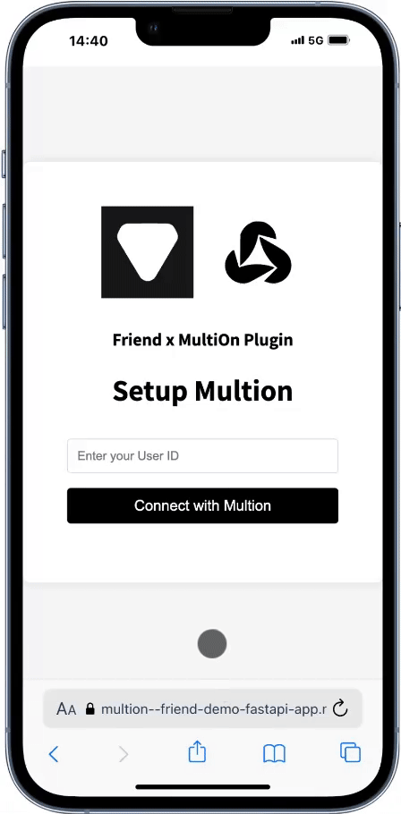

# Setting Up Amazon Add To Cart Plugin (With MultiOn)

The MultiOn plugin allows you to automatically add books mentioned in your conversations to your Amazon cart.

## Setup Steps

1. Open the following link on desktop:
   [https://based-hardware--plugins-api.modal.run/multion](https://based-hardware--plugins-api.modal.run/multion)

2. Follow instructions and copy the USER ID.
   

3. Click [this link](https://based-hardware--plugins-api.modal.run/multion/uid_input) and enter the USER ID.
   

4. After successful authentication, you will be redirected back to the app. The plugin is now set up and ready to use! Return to the Friend app.

## How It Works

1. When you mention books in your conversations, the plugin will automatically detect them.
2. The detected books will be added to your Amazon cart using your MultiOn account.
3. You can review and modify your cart on Amazon before making the purchase.

## Troubleshooting

- If books are not being added to your cart, ensure that your MultiOn account is correctly linked and has the necessary permissions.
- If you encounter any errors, try disconnecting and reconnecting the plugin in your Friend app settings.

---

> This is an experimental feature. It may not work as expected. If you have any feedback, please let us know at team@multion.ai.