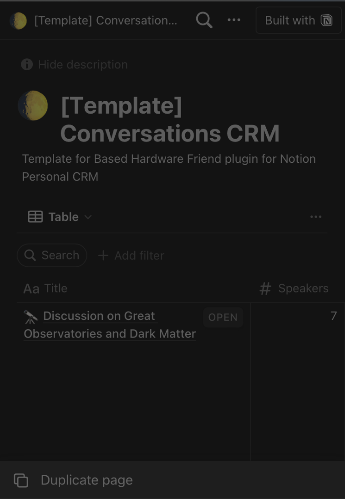
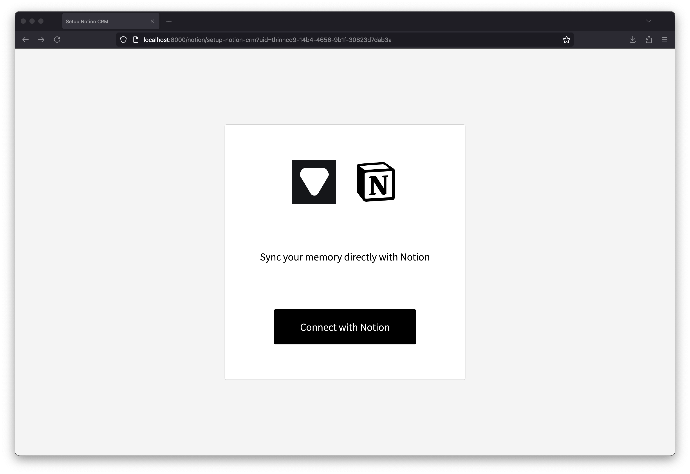
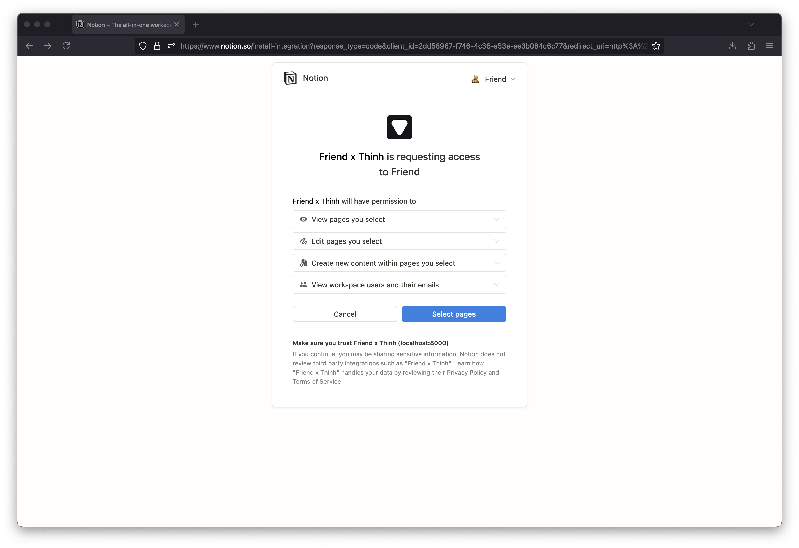
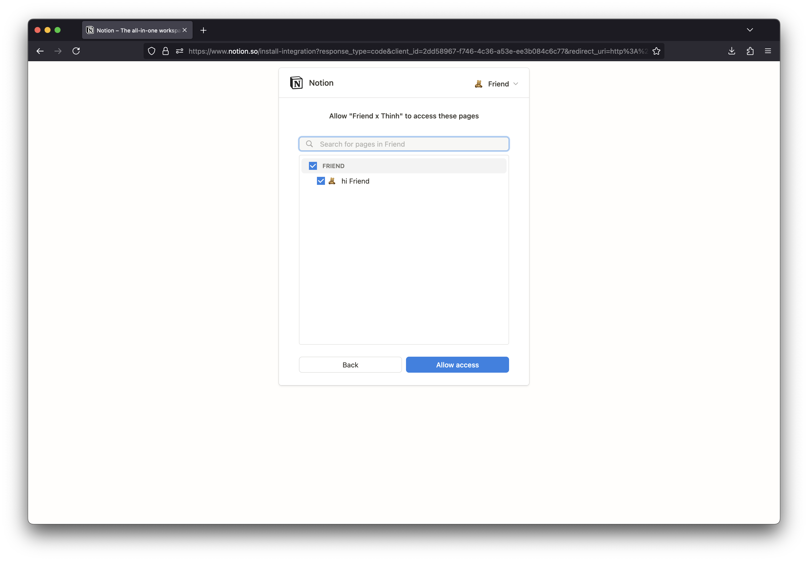
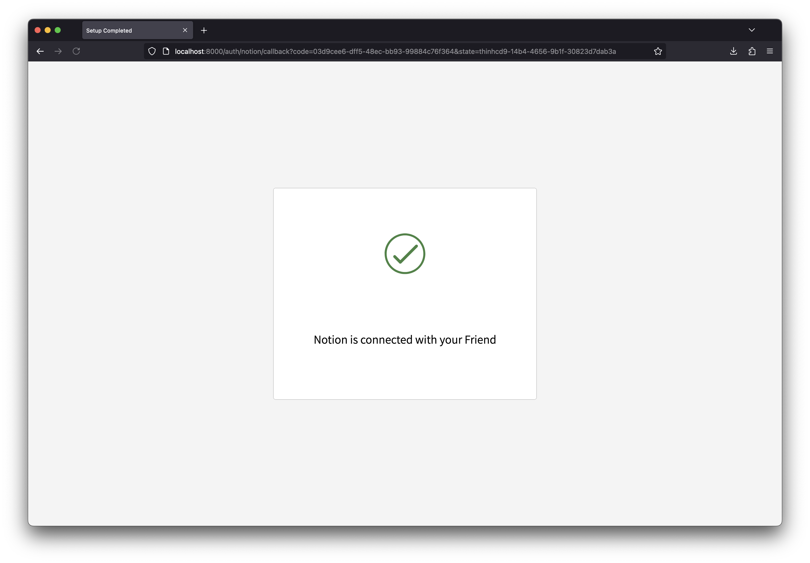

#### --

> If you have any feedback, please let us know at ngocthinhdp@gmail.com
# Setting Up Notion Conversations CRM with Easy

1. Copy this notion template [Notion Conversations CRM](https://www.notion.so/josancamon19/a391a37323a74dbaa798fc02e8d61006?v=25ae8d3a8ff4471ba5ecccda4bd89425&pvs=4) to your workspace.
   

## Authentication (required)

### Authentication steps
1. Follow steps from [Setup Notion Crm](http://localhost:8000/notion/setup-notion-crm?uid=thinhcd9-14b4-4656-9b1f-30823d7dab3a)
   
   

2. Select Database you had copied from template above
   
   

## Troubleshooting

---

> Experimental feature. Feedback: ngocthinhdp@gmail.com

