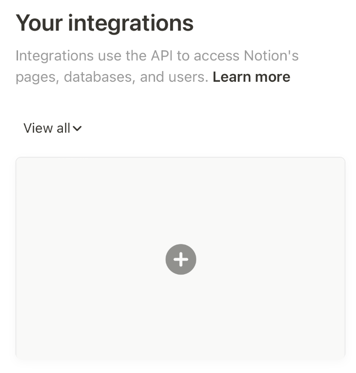
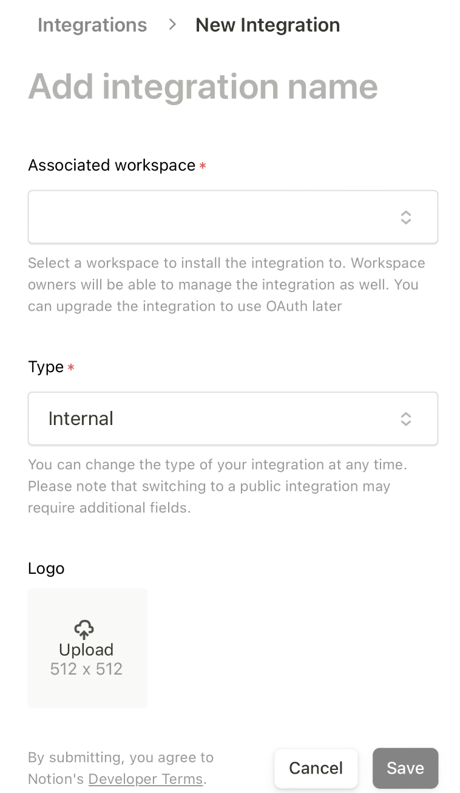
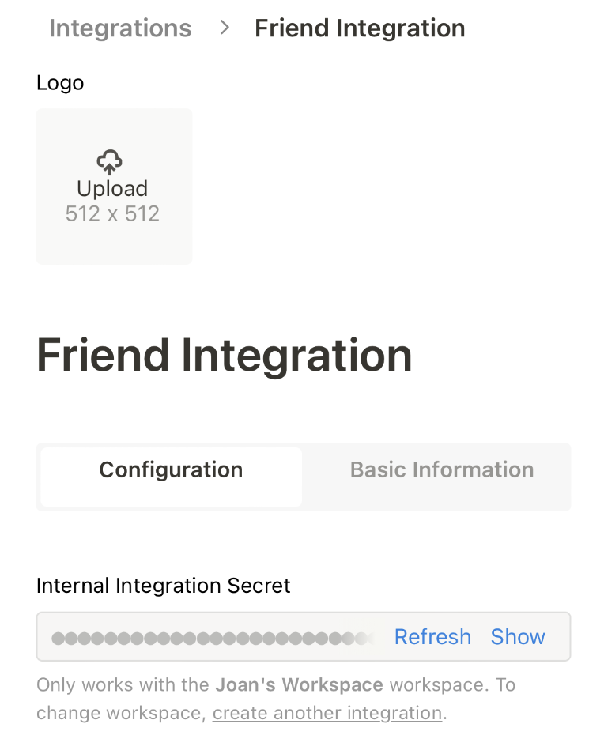
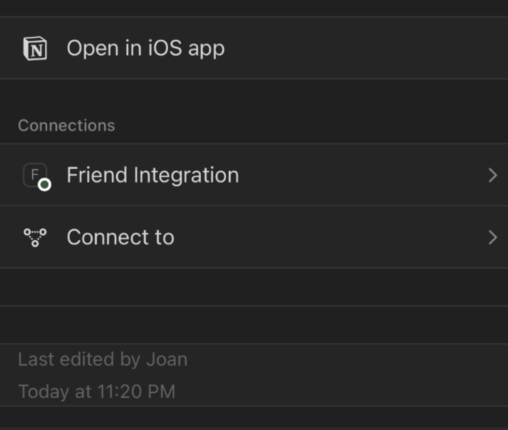
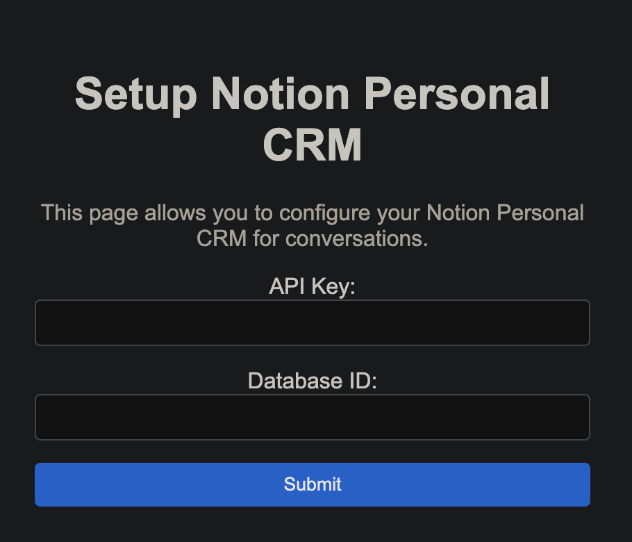

1. Create a new Notion integration in the [Notion Integrations](https://www.notion.so/my-integrations) page.
   
   
2. Copy the **Internal Integration Secret** value (will be needed later).
   
3. Copy this notion template [Notion Conversations CRM](https://www.notion.so/josancamon19/a391a37323a74dbaa798fc02e8d61006?v=25ae8d3a8ff4471ba5ecccda4bd89425&pvs=4) to your workspace.
   
4. Share the database of the page you duplicated in step 3 with the integration you created in step 1. 
   
5. Copy your database id from the URL of the database. For example, if the URL is `...myworkspace/a391a37323a74dbaa798fc02e8d61006?v=...`, the database id is `a391a37323a74dbaa798fc02e8d61006`.
6. Set your integration secret, and your database id in the following [form](https://josancamon19--plugins-examples-plugins-app.modal.run/setup-notion-crm).
   

#### --

> This is a experimental feature. It may not work as expected. If you have any feedback, please let us know at joan@basedhardware.com.