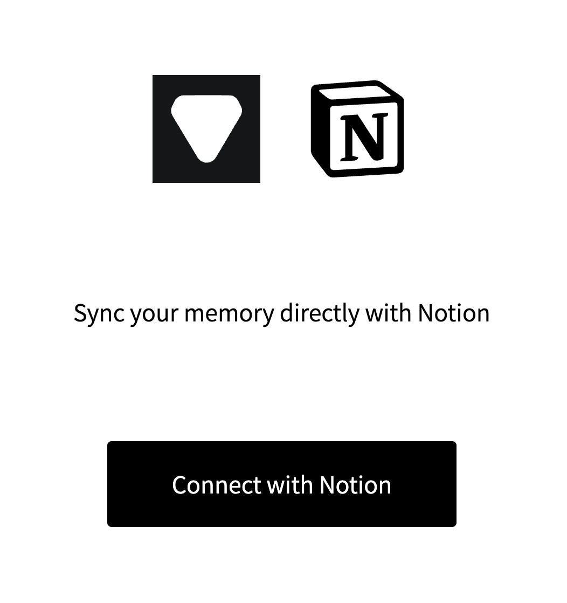

1. Copy this notion template [Notion Conversations CRM](https://www.notion.so/josancamon19/a391a37323a74dbaa798fc02e8d61006?v=25ae8d3a8ff4471ba5ecccda4bd89425&pvs=4) to your workspace.
   
2. Authenticate Notion x Friend [here](https://josancamon19--plugins-examples-plugins-app.modal.run/setup-notion-crm).
   
3. During the authentication, you will be asked to select the workspace and the page where you want to store the conversations.
4. After a workspace is selected, you will be asked to select the page where you want to store the conversations, select the template you copied on Step 1.

#### --

> This is an experimental feature. It may not work as expected. If you have any feedback, please let us know at joan@basedhardware.com.