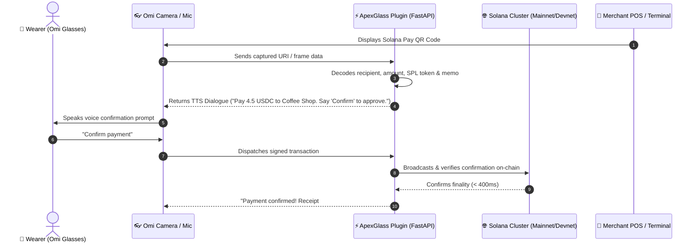

# 👓 ApexGlass: Solana Pay & Crypto Settlement for Omi AI Wearables

[](https://github.com/BasedHardware/omi)
[](https://solanapay.com/)
[](https://opensource.org/licenses/MIT)
[]()

Autonomous cryptocurrency and Solana Pay settlement engine for **BasedHardware Omi** AI smart necklaces and smart glasses (`omiGlass`).

---

## 🏗️ Architecture & Interaction Flow



---

## 🚀 Key Features & Available Omi Chat Tools

| Omi Chat Tool | Method | Description |
| :--- | :--- | :--- |
| **`check_solana_balance`** | `POST` | Queries real-time SOL and lamport balances on Solana Mainnet or Devnet for any base58 address. |
| **`parse_solana_pay_request`** | `POST` | Decodes standard Solana Pay QR codes (`solana:<recipient>?amount=...&label=...&memo=...`) into structured payment parameters. |
| **`generate_payment_intent`** | `POST` | Generates conversational speech prompts for Omi's microphone and TTS speaker (*"Say 'Confirm' to approve"*). |
| **`verify_transaction_signature`** | `POST` | Queries Solana JSON-RPC to check transaction finality status and returns Solscan explorer URLs. |

---

## 💻 Local Development & Studio

### 1. Install Dependencies
```bash
python -m venv .venv
source .venv/bin/activate  # On Windows: .venv\Scripts\activate
pip install -r requirements.txt
```

### 2. Run the Interactive Studio
```bash
uvicorn main:app --reload --port 8080
```
Open **`http://localhost:8080/`** to access the **ApexGlass Visual Studio** featuring:
- **Optical Viewfinder**: Live simulated camera viewfinder with animated laser reticle.
- **Voice Dialogue Player**: Native speech synthesis (Web Speech API) speaking confirmation prompts out loud.
- **On-Chain Balance Inspector**: Instant queries against live Solana public RPCs.

---

## 🧪 Test Verification

Run the automated test suite verifying 100% test coverage:

```bash
# Run unit tests
python -m unittest test_solana_pay.py

# Run end-to-end smoke test
python smoke_test.py
```

---

## 🔒 Safety & Security Guarantees

* **Zero Private Key Exposure**: The plugin operates strictly as a read-only parser and payment request synthesizer. It never touches, stores, or requests user private keys or seed phrases.
* **Base58 Cryptographic Bounds**: Every address and signature is validated against Solana base58 character constraints before dispatching RPC calls.
* **Malformed Input Protection**: Strict sanitization of optical scan noise, negative amounts, and invalid protocols.
