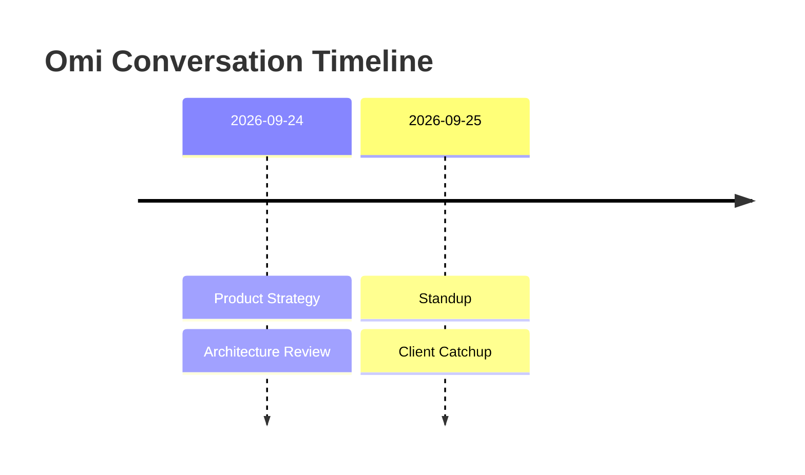
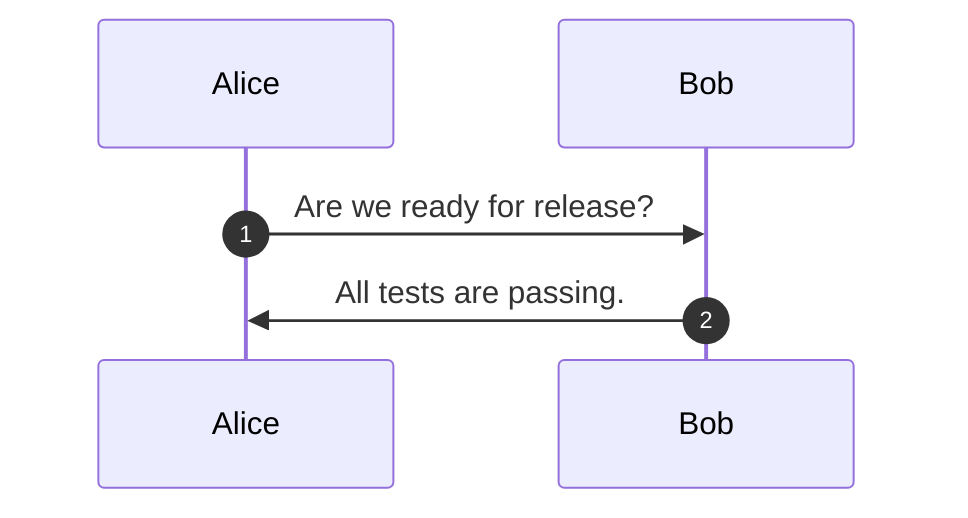

# Generate Mermaid timeline and sequence diagrams from Omi conversations

Use this recipe to visualize your Omi conversations as Mermaid diagrams. You can embed the generated Mermaid blocks directly into GitHub issues/pull requests, Markdown docs, Obsidian notes, or Notion pages.

## Modes

1. **Timeline Mode (`--type timeline`)**: Groups conversations by date on a chronological timeline.
2. **Sequence Mode (`--type sequence`)**: Turns speaker turns from a meeting or interview into a clean Mermaid sequence diagram.

## Prerequisites

- Python 3.10+ (standard library only)
- An authenticated `omi-cli` installation

## Usage

### 1. Daily Conversation Timeline

Export conversation history and generate a timeline:

```sh
omi --json conversation list --limit 20 | python conversations_to_mermaid.py - --type timeline -o timeline.md
```

Sample output:

````markdown

````

### 2. Dialogue Sequence Diagram

Generate a sequence diagram showing speaker turn exchanges:

```sh
python conversations_to_mermaid.py conversation.json --type sequence -o sequence.md
```

Sample output:

````markdown

````

## Features

- **GitHub & Notion Ready**: Generates standard fenced `mermaid` code blocks supported natively by GitHub markdown and Notion.
- **Sanitized Formatting**: Automatically escapes colons, line breaks, and quotes to prevent broken Mermaid syntax.
- **Pure Standard Library**: Zero external dependencies required.
